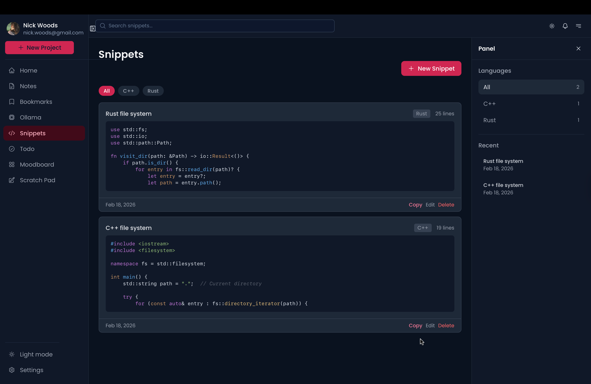

# Almonds

A personal productivity desktop app built with Tauri, Nuxt 4, and Vue 3. Almonds brings your notes, snippets, bookmarks, tasks, and AI conversations into one unified workspace.




---

## Features

- **Notes** — Create and manage personal notes
- **Bookmarks** — Save and organize web links
- **Snippets** — Store reusable code with syntax highlighting
- **Todo** — Track tasks and to-dos
- **Ollama** — Chat with local AI models via Ollama
- **Scratch Pad** — A quick freeform writing space
- **Moodboard** — Visual inspiration board
- **Settings** — Customize the app to your preference

---

## Tech Stack

| Layer | Technology |
|---|---|
| Framework | Nuxt 4 + Vue 3 |
| Desktop | Tauri v2 |
| UI | @nuxt/ui + Tailwind CSS |
| State | Pinia + persisted state |
| Database | Tauri SQL plugin |
| i18n | @nuxtjs/i18n |
| Linting | ESLint + Prettier |

---

## Getting Started

### Prerequisites

- [Node.js](https://nodejs.org/) >= 18
- [Rust](https://www.rust-lang.org/tools/install) (for Tauri)
- [just](https://github.com/casey/just) (task runner)
- [Ollama](https://ollama.com/) (optional, required for AI features)

### Installation

```bash
# Clone the repository
git clone https://github.com/opeolluwa/almonds.git
cd almonds

# Install all dependencies (Node + Cargo tools)
just configure
```

> `just configure` installs `cargo-watch`, `cargo-sort`, `cargo-group-imports`, `sea-orm-cli`, and `seaography-cli`, then creates the local test database file.

### Development

```bash
just watch frontend   # Start the Nuxt dev server (web only)
just watch tauri      # Start the Tauri desktop app in dev mode
just watch almond     # Start both frontend and Tauri concurrently
just watch kernel     # Watch the kernel crate (cargo watch)
```

### Build

```bash
just build almond     # Build the Tauri desktop app
```

### Android

```bash
just android init              # Initialize the Android project
just android watch             # Run the app on Android in dev mode
just android build-apk         # Build an APK (production)
just android build-aab         # Build an AAB
just android keychain <name>   # Generate a release keystore
```

### Lint & Format

```bash
just lint almonds   # Format and lint the frontend (Prettier + ESLint)
just lint orchard   # Format the orchard crate (cargo fmt + sort)
just lint kernel    # Format the kernel crate (cargo fmt + sort)
just lint tauri     # Format the Tauri crate (cargo fmt + sort)
just lint all       # Run all of the above
```

### Database

```bash
just migrate-init            # Initialize SeaORM migrations
just migrate-add <name>      # Generate a new migration
just migrate-run             # Apply pending migrations
just db-pull                 # Migrate, generate entities, and regenerate GraphQL bindings
```

### Clean

```bash
just clean almonds   # Remove node_modules, dist, .nuxt, and Tauri build artifacts
just clean kernel    # Clean kernel Cargo build artifacts
just clean orchard   # Clean orchard Cargo build artifacts
just clean all       # Clean everything
```

---

## Roadmap

Planned features and improvements, based on the current navigation structure:

### Core Modules

- [ ] **Notes** — rich text editing, tagging, search
- [ ] **Bookmarks** — import/export, folder organization, favicon fetch
- [ ] **Snippets** — language detection, copy-to-clipboard, tagging
- [ ] **Todo** — due dates, priorities, recurring tasks
- [ ] **Scratch Pad** — auto-save, markdown preview
- [ ] **Moodboard** — drag-and-drop image layout, image upload

### AI / Ollama

- [ ] Persistent conversation history
- [ ] Multi-model support
- [ ] Context-aware responses using workspace content

### App-wide

- [ ] Global search across all modules
- [ ] Notifications centre
- [ ] Data export (JSON / Markdown)
- [ ] Sync across devices
- [ ] Plugin/extension system

---

## License

MIT License — see [LICENSE](LICENSE) for details.
